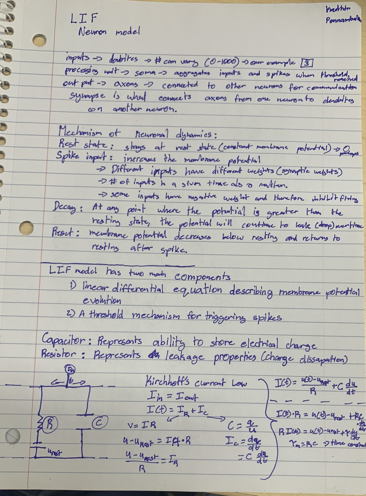
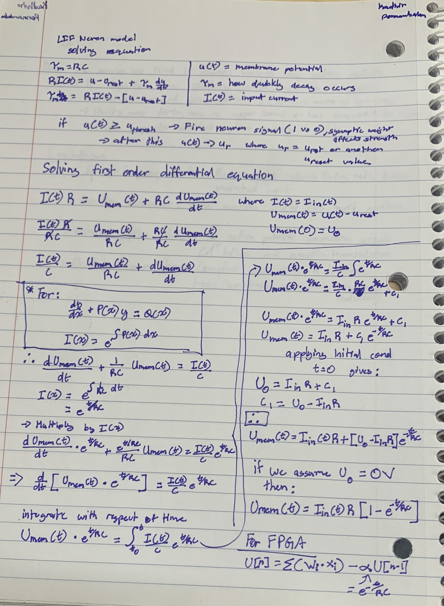
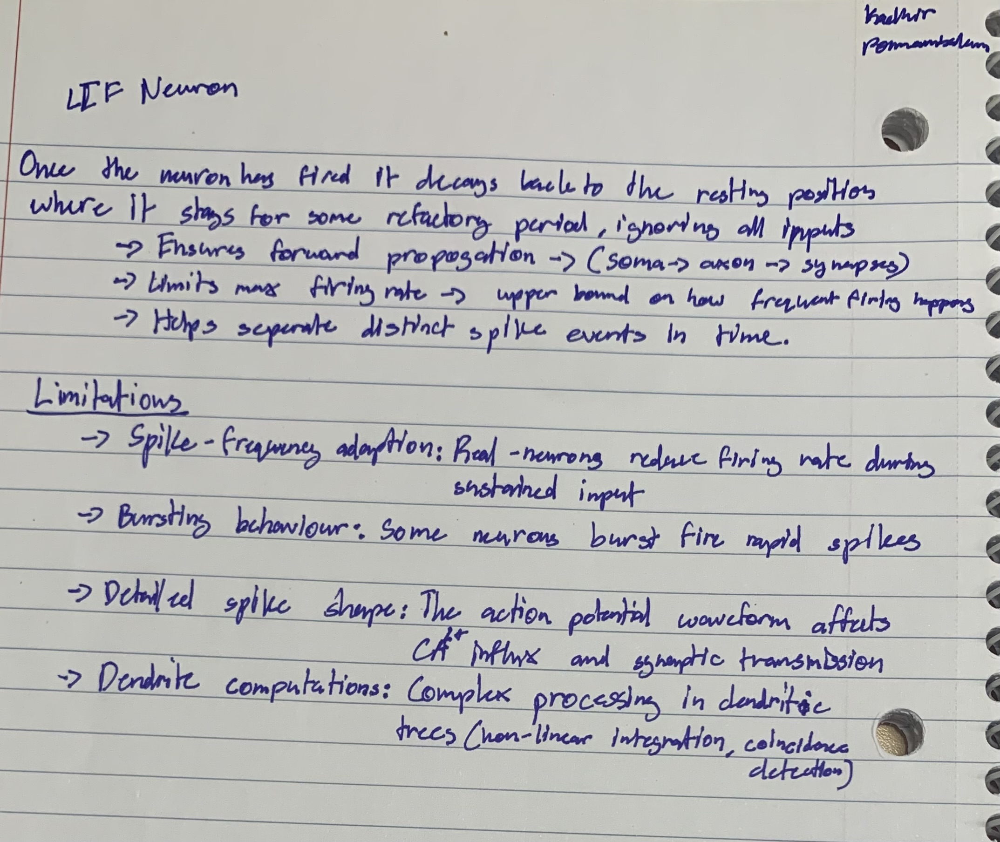

# PROJECT TIMELINE & OBJECTIVES

**Short Disclaimer**
This .md file is for people that want to understand what process as well as stuggles I went through to complete this project. Through this approach I will learn a lot and hit many roadblocks, which I hope to overcome. By following this file, you can see what my objectives, by path to implementation, and learning is.

## 1. Learning stage
Read through the following post (https://medium.com/@himasharandil/from-neurons-to-mathematics-the-leaky-integrate-and-fire-model-in-computational-neuroscience-594dfac6e8b4) to learn more about Leaky Integrate and Fire model and to solve the differential equations revolving around how to simulate it.

